<h1 align="center">Olá! Eu sou Amanda 👋</h1>

🎓 Graduada em Ciências de dados  
📊 A procura de uma oportunidade na área de dados  
💻 Desenvolvendo projetos na prática de Python e SQL

---

## 👩‍💻 Sobre mim
Sou formada em Ciência de Dados e tenho interesse em construir minha carreira nas áreas de análise de dados, administrativa e tecnologia. Ao longo da minha formação, desenvolvi conhecimentos em modelagem e análise de dados, bancos de dados, Python, SQL, Power BI, HTML5 e fundamentos de cibersegurança, além de utilizar o Excel como ferramenta de apoio à organização e análise de informações.

Tenho perfil analítico, organizado e comprometido, com facilidade para aprender novas ferramentas e trabalhar com dados e processos. Busco aprimorar continuamente meus conhecimentos por meio de estudos e projetos práticos, acreditando que o aprendizado constante é essencial para o crescimento profissional.

Estou em busca de uma oportunidade para aplicar meus conhecimentos, desenvolver novas competências e contribuir de forma colaborativa para os resultados da organização.

---

## 🚀 Tecnologias

### Também possuo conhecimentos em

- Excel (Intermediário)
- Power BI (Básico)
- SQL
- Pandas
- Matplotlib

---

## 📊 GitHub Stats
## 📊 GitHub Stats

---

## 🔥 GitHub Streak

---

## 📂 Projetos em destaque

📌 Em breve você encontrará aqui projetos envolvendo:

- 📈 Análise Exploratória de Dados
- 🐍 Python
- 🗄️ SQL
- 📊 Power BI

---

## 📫 Contato

---

